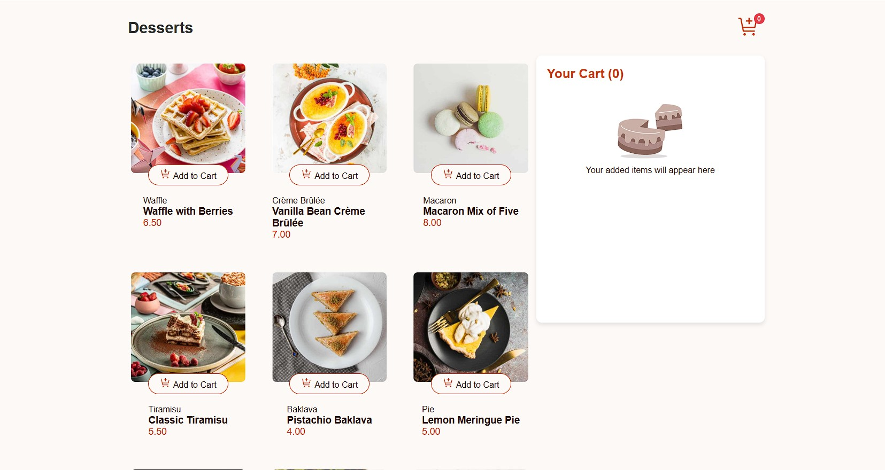

# Frontend Mentor - Product list with cart solution

Esta é uma solução para o [Product list with cart challenge on Frontend Mentor](https://www.frontendmentor.io/challenges/bento-grid-RMydElrlOj). Os desafios do Frontend Mentor ajudam você a melhorar suas habilidades de codificação através da construção de projetos realistas. 

## Índice

- [Visão Geral](#visão-geral)
  - [O Desafio](#o-desafio)
  - [Captura de Tela](#captura-de-tela)
  - [Links](#links)
- [Meu Processo](#meu-processo)
  - [Tecnologias Usadas](#tecnologias-usadas)
  - [O Que Aprendi](#o-que-aprendi)
  - [Desenvolvimento Contínuo](#desenvolvimento-contínuo)
  - [Recursos Úteis](#recursos-úteis)
- [Autor](#autor)
- [Agradecimentos](#agradecimentos)

## Visão Geral

### O Desafio

Os usuários devem ser capazes de:

- Visualizar o layout ideal para a interface, dependendo do tamanho da tela do dispositivo

### Captura de Tela

### Links

- URL da solução: [Solução](https://urickalberth.github.io/frontendMentor/product-list-with-cart-main/)

### Tecnologias Usadas

- HTML5 semântico
- Propriedades personalizadas do CSS
- Flexbox
- CSS Grid
- JS

## Autor

- Website - [Portifólio](https://urickalberth.github.io/)
- Frontend Mentor - [@UrickAlberth](https://www.frontendmentor.io/profile/UrickAlberth)
- LinkedIn - [Urick Alberth](https://www.linkedin.com/in/urick-alberth-109253184)

